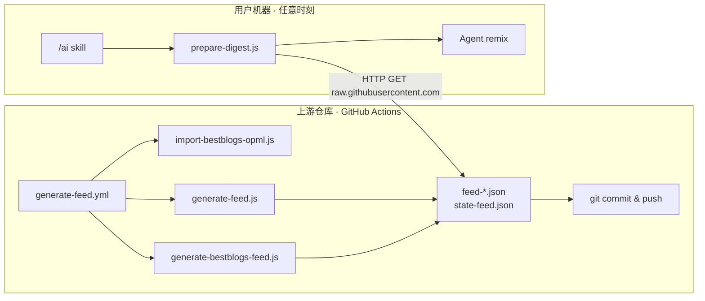

# 中央 Feed 生产流水线

本文档说明 `.github/workflows/generate-feed.yml` 及其调用的脚本如何工作，以及它与用户侧 `/ai` skill 的关系。

---

## 目录

- [定位与边界](#定位与边界)
- [整体架构](#整体架构)
- [触发方式](#触发方式)
- [执行逻辑](#执行逻辑)
- [各 mode 产出对照表](#各-mode-产出对照表)
- [提交产物说明](#提交产物说明)
- [所需 Secrets](#所需-secrets)
- [相关脚本](#相关脚本)
- [与用户 skill 的关系](#与用户-skill-的关系)
- [自行维护 feed（Fork 指南）](#自行维护-feedfork-指南)
- [本地调试](#本地调试)
- [常见问题](#常见问题)

---

## 定位与边界

| 角色 | 是否参与本 workflow | 说明 |
|------|---------------------|------|
| 上游维护者仓库（如 `FlyAIBox/follow-builders`） | **是** | 配置 secrets，定时或手动跑流水线 |
| 普通用户 / fork 仅用于 skill | **否** | 只消费已 push 的 `feed-*.json` |
| `/ai` skill 调用 | **无关** | 任意时刻 HTTP 拉取 JSON，与 Actions 调度解耦 |

**核心原则：** 需要 API 密钥的抓取集中在 GitHub Actions；用户侧永远不需要 X、pod2txt 等密钥。

---

## 整体架构



---

## 触发方式

### 1. 定时（schedule）

```yaml
cron: '*/30 * * * *'
```

- **每 30 分钟**执行一次（UTC 每小时的 `:00` 和 `:30`）
- 每次跑**全套**（等价于 `mode: all`）

### 2. 手动（workflow_dispatch）

路径：**GitHub → Actions → Generate Feeds → Run workflow**

可选 `mode`：

| mode | 说明 |
|------|------|
| `all`（默认） | curated 三路 + bestblogs 全套 |
| `tweets-only` | 仅更新 X/Twitter feed |
| `podcasts-only` | 仅更新播客 feed |
| `blogs-only` | 仅更新官方博客 feed |
| `bestblogs-only` | 仅更新 BestBlogs 聚合 feed |

---

## 执行逻辑

workflow 在 **Generate feeds** 步骤中按以下三条分支执行：

```bash
# 分支 1：手动 + bestblogs-only
npm run import-bestblogs && npm run generate-bestblogs-feed

# 分支 2：手动 + tweets-only / podcasts-only / blogs-only
node generate-feed.js --tweets-only   # 或 --podcasts-only / --blogs-only

# 分支 3：定时触发，或手动选 all
npm run import-bestblogs && node generate-feed.js && npm run generate-bestblogs-feed
```

对应 workflow 源码：

```yaml
if [ workflow_dispatch && mode = bestblogs-only ]; then
  import-bestblogs + generate-bestblogs-feed
elif [ workflow_dispatch && mode != all ]; then
  generate-feed.js --${mode}
else
  import-bestblogs + generate-feed.js + generate-bestblogs-feed
fi
```

---

## 各 mode 产出对照表

| 场景 | 执行的脚本 | 更新的文件 | 需要的 Secret |
|------|-----------|-----------|---------------|
| 定时 / `all` | import-bestblogs → generate-feed.js → generate-bestblogs-feed | 全部 4 个 feed + state + bestblogs 配置 | X + POD2TXT（bestblogs 无） |
| `tweets-only` | generate-feed.js `--tweets-only` | `feed-x.json`, `state-feed.json` | `X_BEARER_TOKEN` |
| `podcasts-only` | generate-feed.js `--podcasts-only` | `feed-podcasts.json`, `state-feed.json` | `POD2TXT_API_KEY` |
| `blogs-only` | generate-feed.js `--blogs-only` | `feed-blogs.json`, `state-feed.json` | 无 |
| `bestblogs-only` | import-bestblogs → generate-bestblogs-feed | `feed-bestblogs.json`, `state-feed.json`, bestblogs 配置/OPML | 无 |

> **注意：** 即使只跑某一路 `--*-only`，`generate-feed.js` 仍会在结束时保存 `state-feed.json`，确保跨次运行去重一致。

---

## 提交产物说明

**Commit and push feeds** 步骤会 `git add` 以下文件：

| 文件 / 目录 | 用途 |
|-------------|------|
| `feed-x.json` | X/Twitter 建造者推文，按账号聚合 |
| `feed-podcasts.json` | 播客新节目 + pod2txt 转录文本 |
| `feed-blogs.json` | 官方博客 RSS 全文 |
| `feed-bestblogs.json` | BestBlogs 400+ RSS 源聚合 |
| `state-feed.json` | 去重状态（`seenTweets` / `seenVideos` / `seenArticles` 等） |
| `config/bestblogs-sources.json` | BestBlogs 源注册表 |
| `config/bestblogs/opml/` | 从 BestBlogs 同步的 OPML 文件 |

提交信息固定为 `chore: update feeds [skip ci]`：

- **`[skip ci]`** — 避免 push 后再次触发 CI，形成循环
- **`git diff --cached --quiet \|\| commit`** — 无变更时不创建空提交

---

## 所需 Secrets

在仓库 **Settings → Secrets and variables → Actions** 中配置：

| Secret | 使用者 | 用途 |
|--------|--------|------|
| `X_BEARER_TOKEN` | `generate-feed.js`（tweets 分支） | 调用 X API v2 抓取推文 |
| `POD2TXT_API_KEY` | `generate-feed.js`（podcasts 分支） | 播客 RSS 音频转录为文本 |

缺少对应 secret 时，`generate-feed.js` 会在需要该 key 的分支上直接退出并报错。

bestblogs 链路（`import-bestblogs-opml.js`、`generate-bestblogs-feed.js`）**不需要任何 API key**，仅通过 HTTP 拉取 OPML 和 RSS。

---

## 相关脚本

所有脚本位于 `scripts/` 目录：

| 脚本 | npm 命令 | 职责 |
|------|----------|------|
| `generate-feed.js` | `npm run generate-feed` | 抓 X、播客、官方博客；去重；写三个 curated feed |
| `import-bestblogs-opml.js` | `npm run import-bestblogs` | 从 BestBlogs 同步 OPML → `config/bestblogs-sources.json` |
| `generate-bestblogs-feed.js` | `npm run generate-bestblogs-feed` | 读取 bestblogs 源列表，抓 RSS → `feed-bestblogs.json` |
| `prepare-digest.js` | `npm run prepare-digest` | **用户侧**，不参与本 workflow |

信息源定义：

- **Curated 源：** `config/default-sources.json`（26 个 X 账号、播客、官方博客）
- **BestBlogs 源：** `config/bestblogs-sources.json`（400+ RSS 订阅）

去重机制（`state-feed.json`）：

- 记录已推送的 tweet ID、episode GUID、文章 URL
- 超过 7 天的条目自动 prune，防止文件无限增长
- 由 `generate-feed.js` 和 `generate-bestblogs-feed.js` 共同读写

---

## 与用户 skill 的关系

用户侧 **永远不运行** 本 workflow。消费链路如下：

1. `prepare-digest.js` 从远端拉 feed（默认 `FlyAIBox/follow-builders` 的 `main` 分支）：

   ```javascript
   const FEED_REPO = process.env.FOLLOW_BUILDERS_FEED_REPO || 'FlyAIBox/follow-builders';
   const FEED_BRANCH = process.env.FOLLOW_BUILDERS_FEED_BRANCH || 'main';
   const FEED_BASE = `https://raw.githubusercontent.com/${FEED_REPO}/${FEED_BRANCH}`;
   ```

2. curated feed（x / podcasts / blogs）会与上游 fallback、本地快照比 `generatedAt`，取最新一份
3. 远端全部失败时，才使用仓库根目录下的本地 `feed-*.json` 兜底
4. Agent 读取打包后的 JSON，按 `prompts/` 改写并交付

**时间解耦：** Actions 每 30 分钟更新一次；用户可在任意时刻调用 `/ai` 拉取当前仓库里最新的 JSON。

---

## 自行维护 feed（Fork 指南）

若希望完全掌控 feed 内容或源列表：

1. **Fork** `FlyAIBox/follow-builders`
2. 在 fork 仓库配置 `X_BEARER_TOKEN`、`POD2TXT_API_KEY`
3. **保留** `.github/workflows/generate-feed.yml`，让 Actions 定时 push 到你的 fork
4. 本地设置环境变量，让 skill 拉取你的 fork：

   ```bash
   export FOLLOW_BUILDERS_FEED_REPO=你的用户名/follow-builders
   export FOLLOW_BUILDERS_FEED_BRANCH=main   # 可选，默认 main
   ```

5. （可选）修改 `config/default-sources.json` 调整 curated 源

---

## 本地调试

在维护者机器上模拟 CI 行为（需自行 export secrets）：

```bash
cd scripts && npm install

# 全套（与定时 / all 相同）
export X_BEARER_TOKEN=...
export POD2TXT_API_KEY=...
npm run import-bestblogs
node generate-feed.js
npm run generate-bestblogs-feed

# 单路调试
node generate-feed.js --tweets-only
node generate-feed.js --podcasts-only
node generate-feed.js --blogs-only
npm run import-bestblogs && npm run generate-bestblogs-feed
```

生成文件位于仓库根目录（`feed-*.json`、`state-feed.json`）。

---

## 常见问题

### Q: 我的 fork 里没有这个 workflow，skill 还能用吗？

可以。skill 默认从上游 `FlyAIBox/follow-builders` 拉 feed。fork 里的 `feed-*.json` 只是快照副本，不参与生成。

### Q: 为什么 push 用 `[skip ci]`？

feed 更新是数据 commit，不需要再跑测试或 lint。若无 `[skip ci]`，push 可能触发其他 workflow 形成无意义循环。

### Q: `--blogs-only` 为什么不需要 secret？

官方博客通过 RSS + HTTP 抓取，不依赖 X API 或 pod2txt。

### Q: bestblogs 和 curated 有什么区别？

| 维度 | Curated（generate-feed.js） | BestBlogs |
|------|----------------------------|-----------|
| 源 | `default-sources.json`，人工精选 | 400+ RSS，来自 bestblogs.dev |
| API key | X / pod2txt 部分需要 | 不需要 |
| 输出 | feed-x / podcasts / blogs | feed-bestblogs.json |

### Q: 用户改 `~/.follow-builders/config.json` 会影响 feed 生成吗？

不会。用户配置只影响摘要语言、频率和交付方式；feed 生成完全在上游仓库侧完成。

---

## 参见

- [README.zh-CN.md](../README.zh-CN.md) — 项目总览与 skill 架构
- [config/README.zh-CN.md](../config/README.zh-CN.md) — 信息源配置说明
- `.github/workflows/generate-feed.yml` — workflow 源码（含中文注释）
