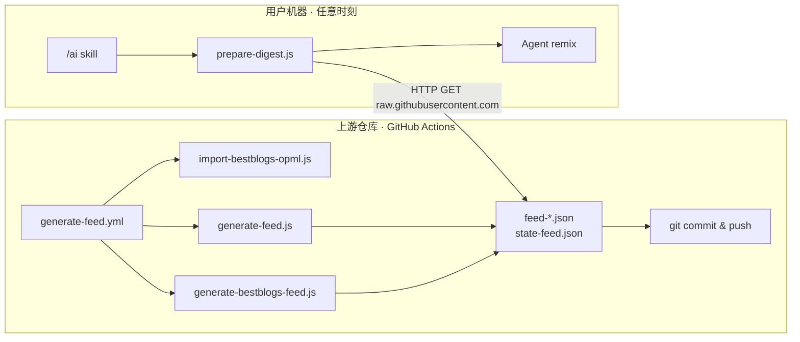

# 中央 Feed 生产流水线

本文档说明 `.github/workflows/generate-feed.yml` 及其调用的脚本如何工作，以及它与用户侧 `/ai` skill 的关系。

---

## 目录

- [定位与边界](#定位与边界)
- [整体架构](#整体架构)
- [触发方式](#触发方式)
- [执行逻辑](#执行逻辑)
- [各 mode 产出对照表](#各-mode-产出对照表)
- [提交产物说明](#提交产物说明)
- [所需 Secrets](#所需-secrets)
  - [谁需要配置](#谁需要配置)
  - [在 GitHub 中设置](#在-github-中设置)
  - [获取 X_BEARER_TOKEN](#获取-x_bearer_token)
  - [获取 POD2TXT_API_KEY](#获取-pod2txt_api_key)
  - [各 mode 与 Secret 对照](#各-mode-与-secret-对照)
- [相关脚本](#相关脚本)
- [与用户 skill 的关系](#与用户-skill-的关系)
- [自行维护 feed（Fork 指南）](#自行维护-feedfork-指南)
- [本地调试](#本地调试)
- [常见问题](#常见问题)

---

## 定位与边界

| 角色 | 是否参与本 workflow | 说明 |
|------|---------------------|------|
| 上游维护者仓库（如 `FlyAIBox/follow-builders`） | **是** | 配置 secrets，定时或手动跑流水线 |
| 普通用户 / fork 仅用于 skill | **否** | 只消费已 push 的 `feed-*.json` |
| `/ai` skill 调用 | **无关** | 任意时刻 HTTP 拉取 JSON，与 Actions 调度解耦 |

**核心原则：** 需要 API 密钥的抓取集中在 GitHub Actions；用户侧永远不需要 X、pod2txt 等密钥。

---

## 整体架构



---

## 触发方式

### 1. 定时（schedule）

```yaml
cron: '*/30 * * * *'
```

- **每 30 分钟**执行一次（UTC 每小时的 `:00` 和 `:30`）
- 每次跑**全套**（等价于 `mode: all`）

### 2. 手动（workflow_dispatch）

路径：**GitHub → Actions → Generate Feeds → Run workflow**

可选 `mode`：

| mode | 说明 |
|------|------|
| `all`（默认） | curated 三路 + bestblogs 全套 |
| `tweets-only` | 仅更新 X/Twitter feed |
| `podcasts-only` | 仅更新播客 feed |
| `blogs-only` | 仅更新官方博客 feed |
| `bestblogs-only` | 仅更新 BestBlogs 聚合 feed |

---

## 执行逻辑

workflow 在 **Generate feeds** 步骤中按以下三条分支执行：

```bash
# 分支 1：手动 + bestblogs-only
npm run import-bestblogs && npm run generate-bestblogs-feed

# 分支 2：手动 + tweets-only / podcasts-only / blogs-only
node generate-feed.js --tweets-only   # 或 --podcasts-only / --blogs-only

# 分支 3：定时触发，或手动选 all
npm run import-bestblogs && node generate-feed.js && npm run generate-bestblogs-feed
```

对应 workflow 源码：

```yaml
if [ workflow_dispatch && mode = bestblogs-only ]; then
  import-bestblogs + generate-bestblogs-feed
elif [ workflow_dispatch && mode != all ]; then
  generate-feed.js --${mode}
else
  import-bestblogs + generate-feed.js + generate-bestblogs-feed
fi
```

---

## 各 mode 产出对照表

| 场景 | 执行的脚本 | 更新的文件 | 需要的 Secret |
|------|-----------|-----------|---------------|
| 定时 / `all` | import-bestblogs → generate-feed.js → generate-bestblogs-feed | 全部 4 个 feed + state + bestblogs 配置 | X + POD2TXT（bestblogs 无） |
| `tweets-only` | generate-feed.js `--tweets-only` | `feed-x.json`, `state-feed.json` | `X_BEARER_TOKEN` |
| `podcasts-only` | generate-feed.js `--podcasts-only` | `feed-podcasts.json`, `state-feed.json` | `POD2TXT_API_KEY` |
| `blogs-only` | generate-feed.js `--blogs-only` | `feed-blogs.json`, `state-feed.json` | 无 |
| `bestblogs-only` | import-bestblogs → generate-bestblogs-feed | `feed-bestblogs.json`, `state-feed.json`, bestblogs 配置/OPML | 无 |

> **注意：** 即使只跑某一路 `--*-only`，`generate-feed.js` 仍会在结束时保存 `state-feed.json`，确保跨次运行去重一致。

---

## 提交产物说明

**Commit and push feeds** 步骤会 `git add` 以下文件：

| 文件 / 目录 | 用途 |
|-------------|------|
| `feed-x.json` | X/Twitter 建造者推文，按账号聚合 |
| `feed-podcasts.json` | 播客新节目 + pod2txt 转录文本 |
| `feed-blogs.json` | 官方博客 RSS 全文 |
| `feed-bestblogs.json` | BestBlogs 400+ RSS 源聚合 |
| `state-feed.json` | 去重状态（`seenTweets` / `seenVideos` / `seenArticles` 等） |
| `config/bestblogs-sources.json` | BestBlogs 源注册表 |
| `config/bestblogs/opml/` | 从 BestBlogs 同步的 OPML 文件 |

提交信息固定为 `chore: update feeds [skip ci]`：

- **`[skip ci]`** — 避免 push 后再次触发 CI，形成循环
- **`git diff --cached --quiet \|\| commit`** — 无变更时不创建空提交

---

## 所需 Secrets

### 谁需要配置

| 角色 | 是否需要配置 Secret |
|------|---------------------|
| 普通用户（只用 `/ai` skill） | **否** — 默认从上游 `FlyAIBox/follow-builders` 拉取已发布的 `feed-*.json` |
| Fork 仓库并自行跑 `generate-feed.yml` | **是** — 需在本仓库配置下表中的 Secret |

### 在 GitHub 中设置

1. 打开你的仓库（例如 `https://github.com/你的用户名/follow-ai-builders`）
2. 进入 **Settings → Secrets and variables → Actions**
3. 点击 **New repository secret**，分别添加：

| Name | Value |
|------|-------|
| `X_BEARER_TOKEN` | X API Bearer Token |
| `POD2TXT_API_KEY` | pod2txt API Key |

workflow 会通过 `${{ secrets.XXX }}` 注入为环境变量（见 `.github/workflows/generate-feed.yml`）。

配置完成后，到 **Actions → Generate Feeds → Run workflow** 手动触发一次，验证流水线是否正常。

### 获取 X_BEARER_TOKEN

来自 [X Developer Console](https://console.x.com/)（新版 **Pay Per Use** 模式）：

> **注意：** 2026 年起 X API 已改为按量付费（Pay Per Use），控制台里通常只有 **App**，不再要求先创建 **Project**。你截图里 Development 下已有的 App 就可以用。

#### 步骤

1. 打开 [console.x.com](https://console.x.com/)，用 X 账号登录并完成开发者协议
2. 左侧进入 **Apps**（你已在该页面）
3. 点击 **Development** 区域里已有的 App（或点 **Create App** 新建一个）
4. 在 App 详情页找到 **App-Only Authentication → Bearer Token**
5. 复制 Bearer Token，粘贴到 GitHub Secret `X_BEARER_TOKEN`

#### 计费说明

- 新版 API **没有免费套餐**，需在左侧 **Billing** 中添加支付方式并购买 credits，Bearer Token 才能正常调用接口
- 本仓库为低用量只读场景（约 26 个账号、每 30 分钟跑一次），费用通常不高，但需自行关注 **Usage** 页面的消耗

#### 验证 Token 是否可用

```bash
curl -H "Authorization: Bearer 你的TOKEN" \
  "https://api.x.com/2/users/by/username/karpathy"
```

返回用户 JSON 即表示 Token 有效。

#### X 开发者申请表填写参考

首次申请或更新开发者账号时，表单会要求填写 **"Describe all of your use cases of X's data and API"**。以下为与项目实际行为一致的英文描述，可直接粘贴（表单要求英文）：

**推荐版本：**

```text
I am building a personal, non-commercial AI industry reading tool called "Follow Builders." It helps me follow a curated list of public X accounts from AI researchers, founders, product leaders, and engineers, and turn their recent posts into a private daily digest for my own reading.

How I use X's API:
- Use X API v2 to look up public user profiles for about 26 curated accounts (GET /2/users/by)
- Fetch recent public original tweets from those accounts (GET /2/users/:id/tweets)
- Only retrieve tweets from the last 24 hours
- Exclude retweets and replies
- Limit to a small number of new tweets per account per run
- Store tweet ID, text, created time, public metrics, and a link back to the original post on x.com

How the data is used:
- The fetched data is processed by an automated script running in my private GitHub repository via GitHub Actions every 30 minutes
- The script writes a JSON feed file for personal consumption only
- The digest includes attribution and links back to the original posts on X
- I do not resell, sublicense, or commercially redistribute X data
- I do not provide a public search engine, analytics product, or third-party data service
- This is a read-only, low-volume use case for personal research and learning

I will comply with the X Developer Agreement, Developer Policy, and rate limits.
```

**精简版本**（字数受限时使用）：

```text
Personal non-commercial project: a private AI industry digest tool. I use X API v2 to read recent public tweets from about 26 curated AI builder accounts, exclude retweets/replies, and generate a JSON feed in my private GitHub repo for my own reading. Data includes tweet text, timestamp, metrics, and links back to x.com. No resale or public redistribution of X data. Read-only, low-volume usage.
```

填写建议：

- **Account name** 可用项目名，如 `Follow Builders Feed`
- 若有 **Website / App URL** 字段，填你的 GitHub 仓库地址
- 描述应具体、诚实，强调**只读、个人用途、不转售数据**
- 新版 API 为按量付费（Pay Per Use），需在 Billing 购买 credits；本仓库会抓取约 26 个 X 账号

#### 脚本实际调用的 API

| 端点 | 用途 |
|------|------|
| `GET /2/users/by` | 批量查询公开账号的 user ID 与简介 |
| `GET /2/users/:id/tweets` | 拉取最近 24 小时内的原创推文（排除转推和回复，每账号最多 3 条新推文） |

### 获取 POD2TXT_API_KEY

用于调用 `https://pod2txt.vercel.app/api/transcript`，将播客 RSS 音频转录为文本（`generate-feed.js` 的 podcasts 分支）。

该服务**没有公开的自助注册页面**。通常需要：

- 向项目维护者（上游 [zarazhangrui/follow-builders](https://github.com/zarazhangrui/follow-builders) 或你 fork 的来源方）申请 key，或
- 使用你自己部署的 pod2txt 实例对应的 key

若暂时没有 `POD2TXT_API_KEY`，可先手动触发 `blogs-only`、`bestblogs-only` 或 `tweets-only` 模式，跳过播客分支。

### 各 mode 与 Secret 对照

| 场景 | 需要的 Secret |
|------|---------------|
| 定时 / `all`（默认全套） | `X_BEARER_TOKEN` + `POD2TXT_API_KEY` |
| `tweets-only` | `X_BEARER_TOKEN` |
| `podcasts-only` | `POD2TXT_API_KEY` |
| `blogs-only` | 无 |
| `bestblogs-only` | 无 |

缺少对应 secret 时，`generate-feed.js` 会在需要该 key 的分支上直接退出并报错（如 `X_BEARER_TOKEN not set`）。

bestblogs 链路（`import-bestblogs-opml.js`、`generate-bestblogs-feed.js`）**不需要任何 API key**，仅通过 HTTP 拉取 OPML 和 RSS。

---

## 相关脚本

所有脚本位于 `scripts/` 目录：

| 脚本 | npm 命令 | 职责 |
|------|----------|------|
| `generate-feed.js` | `npm run generate-feed` | 抓 X、播客、官方博客；去重；写三个 curated feed |
| `import-bestblogs-opml.js` | `npm run import-bestblogs` | 从 BestBlogs 同步 OPML → `config/bestblogs-sources.json` |
| `generate-bestblogs-feed.js` | `npm run generate-bestblogs-feed` | 读取 bestblogs 源列表，抓 RSS → `feed-bestblogs.json` |
| `prepare-digest.js` | `npm run prepare-digest` | **用户侧**，不参与本 workflow |

信息源定义：

- **Curated 源：** `config/default-sources.json`（26 个 X 账号、播客、官方博客）
- **BestBlogs 源：** `config/bestblogs-sources.json`（400+ RSS 订阅）

去重机制（`state-feed.json`）：

- 记录已推送的 tweet ID、episode GUID、文章 URL
- 超过 7 天的条目自动 prune，防止文件无限增长
- 由 `generate-feed.js` 和 `generate-bestblogs-feed.js` 共同读写

---

## 与用户 skill 的关系

用户侧 **永远不运行** 本 workflow。消费链路如下：

1. `prepare-digest.js` 从远端拉 feed（默认 `FlyAIBox/follow-builders` 的 `main` 分支）：

   ```javascript
   const FEED_REPO = process.env.FOLLOW_BUILDERS_FEED_REPO || 'FlyAIBox/follow-builders';
   const FEED_BRANCH = process.env.FOLLOW_BUILDERS_FEED_BRANCH || 'main';
   const FEED_BASE = `https://raw.githubusercontent.com/${FEED_REPO}/${FEED_BRANCH}`;
   ```

2. curated feed（x / podcasts / blogs）会与上游 fallback、本地快照比 `generatedAt`，取最新一份
3. 远端全部失败时，才使用仓库根目录下的本地 `feed-*.json` 兜底
4. Agent 读取打包后的 JSON，按 `prompts/` 改写并交付

**时间解耦：** Actions 每 30 分钟更新一次；用户可在任意时刻调用 `/ai` 拉取当前仓库里最新的 JSON。

---

## 自行维护 feed（Fork 指南）

若希望完全掌控 feed 内容或源列表：

1. **Fork** `FlyAIBox/follow-builders`
2. 在 fork 仓库配置 [所需 Secrets](#所需-secrets)（`X_BEARER_TOKEN`、`POD2TXT_API_KEY`）
3. **保留** `.github/workflows/generate-feed.yml`，让 Actions 定时 push 到你的 fork
4. 本地设置环境变量，让 skill 拉取你的 fork：

   ```bash
   export FOLLOW_BUILDERS_FEED_REPO=你的用户名/follow-builders
   export FOLLOW_BUILDERS_FEED_BRANCH=main   # 可选，默认 main
   ```

5. （可选）修改 `config/default-sources.json` 调整 curated 源

---

## 本地调试

在维护者机器上模拟 CI 行为（需自行 export secrets）：

```bash
cd scripts && npm install

# 全套（与定时 / all 相同）
export X_BEARER_TOKEN=...
export POD2TXT_API_KEY=...
npm run import-bestblogs
node generate-feed.js
npm run generate-bestblogs-feed

# 单路调试
node generate-feed.js --tweets-only
node generate-feed.js --podcasts-only
node generate-feed.js --blogs-only
npm run import-bestblogs && npm run generate-bestblogs-feed
```

生成文件位于仓库根目录（`feed-*.json`、`state-feed.json`）。

---

## 常见问题

### Q: 我没有 API key，skill 还能用吗？

可以。skill 默认从上游 `FlyAIBox/follow-builders` 拉 feed，不需要你配置任何 Secret。只有自行 fork 并运行 `generate-feed.yml` 时才需要配置。

### Q: X 控制台里没有 Project，只有 App？

正常。2026 年新版 [X Developer Console](https://console.x.com/) 采用 **Pay Per Use** 模式，直接在 **Apps → Development** 下创建或使用 App 即可，不需要单独的 Project。点击已有 App，在 **App-Only Authentication** 区域复制 **Bearer Token**。

### Q: X 开发者申请被拒怎么办？

常见原因是 use case 描述过于笼统。请参考 [X 开发者申请表填写参考](#x-开发者申请表填写参考)，写清楚：只读、个人用途、约 26 个公开账号、24 小时窗口、不转售数据。若表单有 Website 字段，填写你的 GitHub 仓库地址。

### Q: 暂时没有 POD2TXT_API_KEY 怎么办？

可先跑 `tweets-only`、`blogs-only` 或 `bestblogs-only` 验证 workflow；播客分支需等拿到 key 后再跑 `podcasts-only` 或全套 `all`。

### Q: 我的 fork 里没有这个 workflow，skill 还能用吗？

可以。skill 默认从上游 `FlyAIBox/follow-builders` 拉 feed。fork 里的 `feed-*.json` 只是快照副本，不参与生成。

### Q: 为什么 push 用 `[skip ci]`？

feed 更新是数据 commit，不需要再跑测试或 lint。若无 `[skip ci]`，push 可能触发其他 workflow 形成无意义循环。

### Q: `--blogs-only` 为什么不需要 secret？

官方博客通过 RSS + HTTP 抓取，不依赖 X API 或 pod2txt。

### Q: bestblogs 和 curated 有什么区别？

| 维度 | Curated（generate-feed.js） | BestBlogs |
|------|----------------------------|-----------|
| 源 | `default-sources.json`，人工精选 | 400+ RSS，来自 bestblogs.dev |
| API key | X / pod2txt 部分需要 | 不需要 |
| 输出 | feed-x / podcasts / blogs | feed-bestblogs.json |

### Q: 用户改 `~/.follow-builders/config.json` 会影响 feed 生成吗？

不会。用户配置只影响摘要语言、频率和交付方式；feed 生成完全在上游仓库侧完成。

---

## 参见

- [README.md](../README.md) — 项目总览与 skill 架构（中文）
- [config/README.zh-CN.md](../config/README.zh-CN.md) — 信息源配置说明
- `.github/workflows/generate-feed.yml` — workflow 源码（含中文注释）
